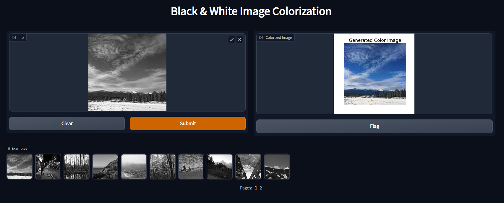
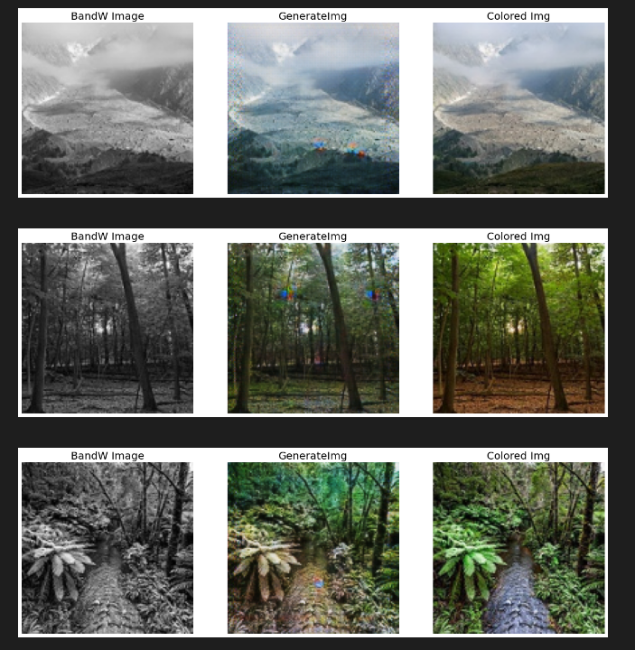
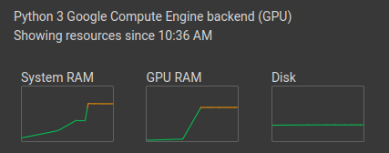
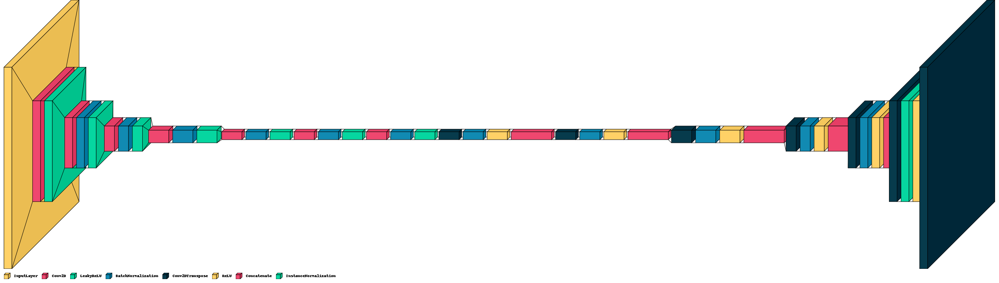
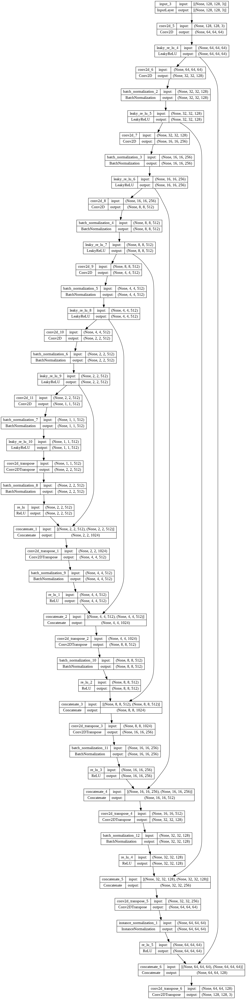
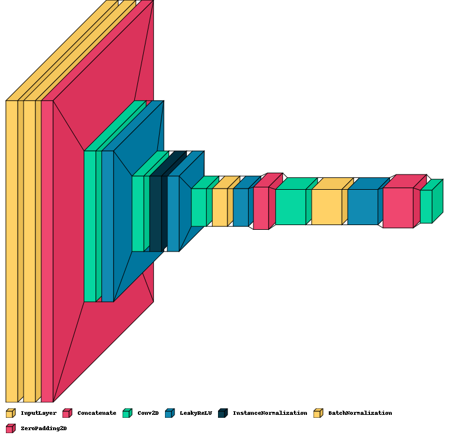
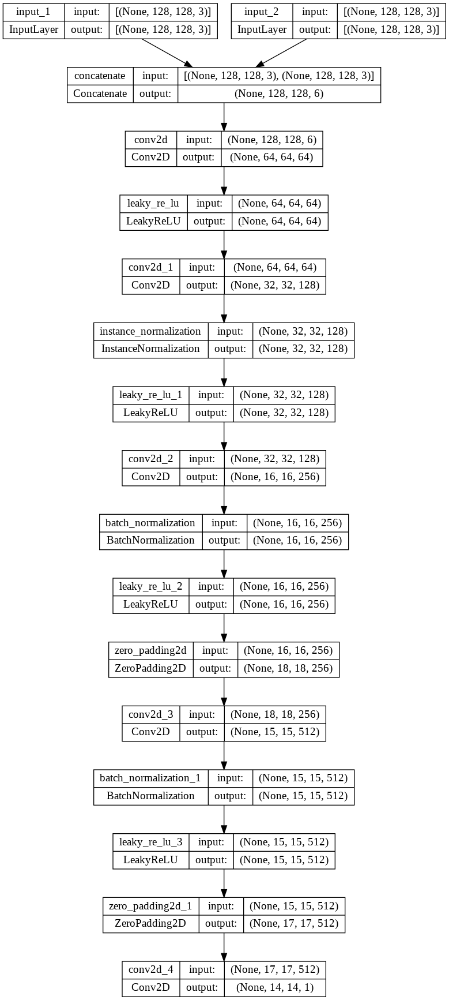

# Pix2Pix Landscape Image 📸 Colorization 🌈
This repository contains the application that allows you to colorize black and white images, using a Pix2Pix GAN architecture. [Demo](https://www.youtube.com/watch?v=dLuGSCm6VrU).



## Examples
Here are some examples of black and white images that have been colorized. 


## Intallation and usage
The Pix2Pix GAN model has been trained on a google colab GPU instance, for speed, and performance reasons. 
The free Google Colab instances offer :
* 12 GB of RAM,
* A Tesla K80 GPU, with 24GB of memory.

Even with these resources, the training took approtimately 1 hour and 40 minutes, to complete, and the resource usage has been pretty heavy. So it's recommended to use that environment if there isn't a better option available.


### It is recommended to install the necessary packages before starting :
```
pip install -r requirements.txt
```

* The training code can be found in the [Pix2Pix GAN Image Coloring notebook.](./Pix2PixGAN_Image_Coloring.ipynb)

* The [training data](https://www.kaggle.com/datasets/theblackmamba31/landscape-image-colorization).

## Training Configuration
The main things to configure prior to training, are the 
```
DATA_PATH = "/content/datapath/"
```
The batch size, according to the GPU memory that is available.
```
BATCH_SIZE = 16
```
The number of training epochs (Default configuration is 100, can be increased or decreased for better model tuning).
```
fit(EPOCHS = 100)
```
And the image size:
```
y.append(img_to_array(Image.fromarray(cv2.resize(img1,(128,128)))))
X.append(img_to_array(Image.fromarray(cv2.resize(img2,(128,128)))))
```
The current size is 128 * 128 pixels, but it can be increased for higher quality of generate images.

The trained **keras** model weights will be saved in the parent directory under a folder named ```model```, under the name ```gen0.h5```.

## Usage
To use the web app directly, just run this command in a desired terminal and open the hosted app address in a browser.
```
python app.py
```

# Pix2Pix GAN Neural Network
2 neural networks hve been used :

## PatchGAN Generator
This neural network is trying to generate the colorized versions of the images.




## U-NET Discriminator
The neural network is trying to classify if an image has been artifically colorized.

The two models work together to respectivelly learn to generate colorized versions of black and white imagas, and to classify if an image is artifically colorized or not.




## References
* [Pix2Pix GAN For Image Colourisation](https://www.kaggle.com/code/shiratorizawa/pix2pix-gan-for-image-colourisation)
* [Tensorflow Pix2Pix GAN](https://www.tensorflow.org/tutorials/generative/pix2pix)
